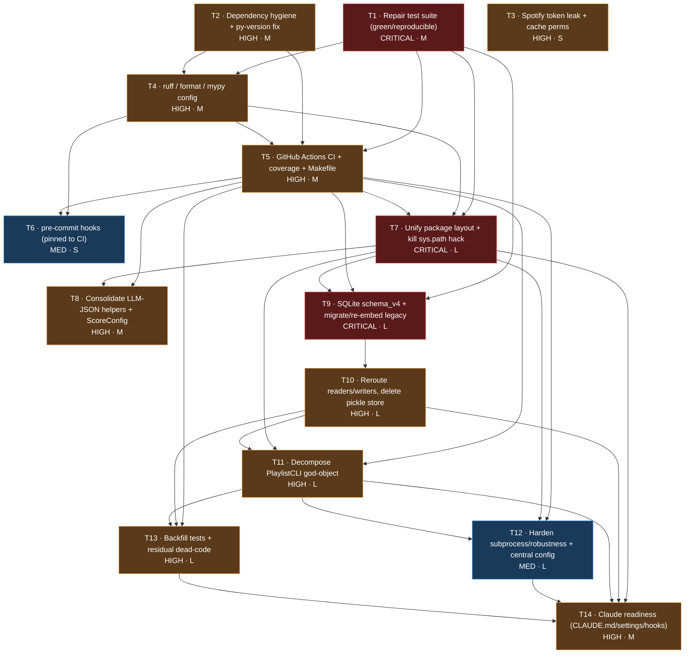

# tunr — Remediation Plan (Task DAG)

> Generated 2026-05-29 from a 19-agent audit (9 dimensions → adversarial verify → DAG synthesis).
> **71 findings verified, 0 dropped.** 14 tasks, 10 dependency-ordered waves.

## Overall assessment

A functional but architecturally tangled single-developer Python CLI **mid-migration between two persistence systems**. The legacy pickle/numpy store still holds the **only copy of production data** (1,247 songs, 384-dim embeddings, 20 rotation generations); the SQLite store sits empty. The most urgent problems are *operational*, not design:

- The **test suite aborts out-of-the-box** — a global `Path.__new__` monkeypatch causes a process-killing `RecursionError`, and a stale `site-packages` shim shadows `src/models.py`.
- **No CI, no lint/format/type tooling.**
- The declared **`requires-python >=3.9` floor is already broken** by PEP 585 `list[str]` syntax in `arg_parse.py`.
- **Live-looking Spotify tokens sit world-readable** (`0644`) on disk.

Strategy: front-load safety + reproducibility (waves 1–3) so every later change is guarded, then sequence the risky structural work in dependency order — unify package layout/imports, consolidate the dual stores onto SQLite (with a re-embedding migration that also closes a pickle-RCE surface), then decompose the 2,400-line `PlaylistCLI` god-object. **Claude readiness is the terminal wave** so it documents the genuinely cleaned-up state.

## Dependency graph

## Waves

| Wave | Theme | Tasks |
|---|---|---|
| 1 | Safety foundation: green/reproducible tests, dep hygiene, secret remediation | T1, T2, T3 |
| 2 | Static-analysis tooling configured + green | T4 |
| 3 | CI gate, coverage baseline, task runner | T5 |
| 4 | Pre-commit parity + package-layout/import unification | T6, T7 |
| 5 | Guarded duplication cleanup + SQLite schema + legacy migration spine | T8, T9 |
| 6 | Dual-storage consolidation onto single SQLite system of record | T10 |
| 7 | God-object decomposition (command registry + services) | T11 |
| 8 | Subprocess/robustness hardening + centralized config | T12 |
| 9 | Test backfill on consolidated structure + dead-code removal | T13 |
| 10 | Claude Code readiness documenting the cleaned-up state | T14 |

## Tasks

### T1 — Repair the test suite so it collects and runs green out-of-the-box  ·  **CRITICAL · M · wave 1 · deps: none**
Fix the suite-aborting `RecursionError` in `tests/test_commands.py:495` (drop the global `monkeypatch.setattr(main.Path, '__new__', ...)`; the `with patch('main.Path')` already covers it; add a real assertion to `test_list_backups_no_directory`). Remove the polluting flat install from pyenv `site-packages` (`pip uninstall playlist_update_cli` + delete stray top-level `models.py`/`spotify_manager.py`/etc. + `*.dist-info`) so `src/models.py` is no longer shadowed. Add `[tool.pytest.ini_options]` with `pythonpath=["src"]`, `testpaths=["tests"]`, `addopts="-ra"`; switch `conftest.py:14` to `sys.path.insert(0, ...)`. Add an autouse fixture injecting a fake `sentence_transformers` into `sys.modules`. *Addresses: TEST-1/2/3/8, CLAUDE-3, CI-6.*

### T2 — Dependency hygiene: drop unused deps, fix py-version, regenerate locks, gitignore artifacts  ·  **HIGH · M · wave 1 · deps: none**
Remove unused `matplotlib`/`click`/`tabulate` (zero usages → drops ~8 transitive pkgs). Fix `requires-python >=3.9` break: add `from __future__ import annotations` to `arg_parse.py` **or** raise floor to match dev venv. Regenerate `uv.lock`/`requirements.txt` (pytest should not be a runtime dep). Resolve untracked `requirements.txt` (gitignore as derived artifact, or commit). Add generic `*.egg-info/` ignore; remove stale leftovers (`src/services/`, `src/config/`, orphaned tree, caches). *Addresses: PKG-1/2/3/4/7/8/9, DEAD-3/4.*

### T3 — Remediate world-readable Spotify token leak + harden cache perms  ·  **HIGH · S · wave 1 · deps: none**
Delete stale world-readable `.spotify_cache/spotify_token.json` + `.spotify_cache/.spotify_cache` (mode `0644`, live-looking tokens from an old naming scheme). **Treat tokens as compromised** → revoke app access in Spotify dashboard + re-auth. Harden `spotify_manager.py:69-76` to `chmod 0700` the dir and `0600` the token file even when they pre-exist, plus `os.chmod` after writes. *(Requires user coordination for revocation.)* *Addresses: SEC-1.*

### T4 — Add lint, format, type-check tooling config  ·  **HIGH · M · wave 2 · deps: T1, T2**
Add `[tool.ruff]` (target-version per chosen floor, line-length 100, `select=[E,F,W,I]`, `extend-ignore=[E501]`, per-file E402 ignores). Remove confirmed unused imports so F-checks pass. Run `ruff format` once as an isolated commit. Add non-strict `[tool.mypy]` (mypy_path=src, explicit_package_bases, ignore_missing_imports for spotipy/tqdm/sentence_transformers/sklearn). *Addresses: TOOL-1/2/3, DEAD-2.*

### T5 — GitHub Actions CI, coverage baseline, Makefile  ·  **HIGH · M · wave 3 · deps: T1, T2, T4**
`.github/workflows/ci.yml`: `test` job (matrix floor→3.12, `pip install -e .[dev]`, pytest) + single-version `lint` job (`ruff check`, `ruff format --check`, `mypy src`). Add `pytest-cov`, coverage config, establish baseline + `--cov-fail-under=<baseline>` ratchet. Add a `Makefile` (install/lint/format/typecheck/test/cov/ci) that CI invokes so local ≡ CI. *Addresses: CI-1, COV-1, TOOL-5.*

### T6 — Pre-commit hooks pinned to CI toolchain  ·  **MED · S · wave 4 · deps: T4, T5**
`.pre-commit-config.yaml`: standard hygiene hooks + `ruff`/`ruff-format` pinned to the **same rev as CI** + a local `mypy src` hook. Add `pre-commit` to dev deps; document `pre-commit install`. *Addresses: TOOL-4.*

### T7 — Unify package layout + import convention; eliminate sys.path hack  ·  **CRITICAL · L · wave 4 · deps: T1, T4, T5**
Resolve the **module-identity hazard** (`import models` vs `import src.models` → two distinct module objects, breaking `isinstance`). Pick one canonical layout and apply everywhere; delete the `sys.path.insert` hack (`main.py:7-9`) + conftest append; standardize sub-package imports (incl. `nextgen/providers.py:6`); rename `src/setup.py` out of the conventional setup.py role. Update all test imports in the same change. *Addresses: ARCH-1/4, PKG-5/6.*

### T8 — Consolidate duplicated LLM-JSON helpers + disambiguate two ScoreConfig classes  ·  **HIGH · M · wave 5 · deps: T5, T7**
Extract byte-identical `_try_parse_json`/`_extract_json_block` + canonical `_strip_fence`/`_parse_json_output` into `src/llm_json.py`; reconcile drifted variants; keep provider-specifics parameterized. Rename colliding `ScoreConfig` → `PlaylistScoreConfig` (`scoring.py:23`) and `SearchScoreConfig` (`nextgen/scoring.py:10`); drop the defensive guard at `main.py:151-163`. *Addresses: DUP-1/3.*

### T9 — SQLite schema_v4 + migrate/re-embed legacy pickle data  ·  **CRITICAL · L · wave 5 · deps: T1, T5, T7**
The pickle store holds the **only copy** of prod data. Add `schema_v4` (`playlists`, `rotation_generations`, `generation_tracks`); bump `LATEST_VERSION`; add v3→v4 migration. Write idempotent `migrate_legacy()` that snapshots `data/` first, upserts artists/tracks (`track_id` identical across stores), **re-embeds** 1,247 tracks with the canonical sentence-transformer model (do NOT copy 384-dim TF-IDF vectors — incompatible with 768-dim mpnet), and migrates history generations. Add a safe pickle→SQLite loader (closes the deserialization RCE surface). Verify row counts. *Addresses: STORE-2/3/4/5, CR-1, SEC-2.*

### T10 — Reroute all readers/writers onto SQLite + delete legacy pickle store  ·  **HIGH · L · wave 6 · deps: T9**
Reroute writers (`import_songs`, `clean_database`, `sync_playlist`, `create_playlist_from_search_results`, setup script) to upsert via repos; reroute readers (`RotationManager`, `scoring.py` providers, `interactive_app.py:725`) to repos + `EmbeddingModel` + `track_embeddings` cosine path. Delete `src/db_manager.py`, dead `add_search_results_to_db`, legacy data dirs (snapshot first). Wrap multi-step SQLite ops in `Database.session()` for atomicity. Centralize `artist|||name` id construction into one helper. *Addresses: STORE-1/6/7/8/9, DUP-2, ARCH-5.*

> **Status (2026-05-29):** Partially done. The command registry (replacing the ~200-line if/elif `dispatch_command` ladder), the `debug` table presenter extraction, and the atomic `restore_data` hardening are complete (commit `81bde5f`). The deeper per-domain **service-object extraction** (Search/Rotation/Ingest/Maintenance/Auth) is **deferred**: the 50+ `PlaylistCLI` methods are pinned by `test_dispatch_command.py`/`test_commands.py`, so wrapping them in services is high-risk, low-marginal-value churn best done incrementally on top of the registry seam now in place.

### T11 — Decompose the PlaylistCLI god-object  ·  **HIGH · L · wave 7 · deps: T5, T7, T10**
Replace the ~204-line `if/elif` `dispatch_command` ladder (`main.py:2214-2417`) with a command registry (name → handler/presenter); move inline debug-table rendering into a UI presenter. Extract service objects (Search/Rotation/Ingest/Maintenance/Auth) holding lazy spotify/repos handles; move all UI calls out of domain methods → `PlaylistCLI` becomes a slim facade. Harden `restore_data` (`main.py:828-844`) to atomic temp-dir + `os.replace`. Update affected tests. *Addresses: GOD-1, ARCH-2/3, CR-4.*

### T12 — Harden subprocess handling, robustness, centralize config  ·  **MED · L · wave 8 · deps: T5, T7, T11**
`_run_command` (web_search.py, scoring.py): accept tokenized `args: List[str]` for retries (stop corrupting `--output-schema`); thread a depth/attempts cap; validate `args[0]` via `shutil.which`; document that `WEB_SEARCH_*`/`WEB_SCORE_*` execute arbitrary local commands. Narrow broad `except Exception` on material paths. Fix `_extract_year_target` decade math (`nextgen/pipeline.py:40-50`). Document/guard single-threaded SQLite. Introduce a single dataclass `Config` loaded once; dedupe `_env_float/_env_int/_env_flag`; inject into services instead of ~56 scattered `os.getenv`. *Addresses: CR-2/3/5/6/7/8/9, SEC-3/4, ARCH-6.*

### T13 — Backfill tests for untested modules + weak assertions; tidy dead code  ·  **HIGH · L · wave 9 · deps: T5, T10, T11**
Add unit tests for `nextgen/canonicalize.py`, `providers.run_providers`, `ui.py`, `storage/vectors.py`, `embeddings.py` (stub SentenceTransformer). Add real behavioral assertions to `test_import.py` (currently 13 tests/2 assertions incl. `assert True`). Test the new extracted services + interactive dispatch routing. Remove dead `arg_parse.parse_args()` (or restore a real non-interactive CLI). Ratchet `--cov-fail-under` up. *Addresses: TEST-4/5/6/7, ARCH-8.*

### T14 — Claude Code readiness: CLAUDE.md, shared settings.json, hooks  ·  **HIGH · M · wave 10 · deps: T1, T4, T5, T7, T10, T11, T12, T13**
Create `CLAUDE.md` (commands, architecture reflecting the **consolidated** single SQLite store + service layer, conventions, gotchas). Replace `.claude/settings.local.json` stale rules with a checked-in `.claude/settings.json` (allowlist pytest/ruff/mypy/git/make; deny reads of `.spotify_cache/**` + `config/.env*`). Add a `Stop` hook running `pytest -q && ruff check`. Optional `PostToolUse` ruff-on-changed-file. Update `specs/`, remove dead `ai_docs/` reference in `AGENTS.md:22`, add an `ARCHITECTURE.md`. *Addresses: CLAUDE-1/2/4/5/6, ARCH-7.*
